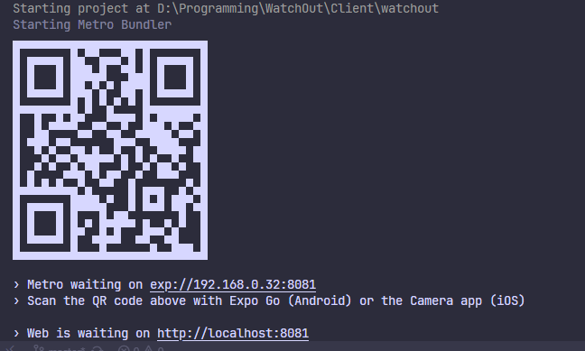

# Watchout

Mobile and Web application which will allow user to report any kind of incident around them to warn other people about the danger.
Incident can be an uncommonly big traffic jam or power outages on certain streets.

## Mobile application - setup guide

### Prerequisites

- [Node.js with npm](https://nodejs.org/en/download)
- [Android Studio *(not necessary but recommended)*](https://developer.android.com/studio)

For best experience and mobile emulation test it on Android/IOS device.

### Launching

1. Go to open terminal and ensure current path is `Client/watchout`
2. Install all packages by command `npm install` (alias `npm i`)
3. Run application by command `npm start`

Application can be opened in web and on mobile device. Application by default will be available under `https://localhost:8081/` url, however this might be a little different depending on your environment.

### Running on Android

There are two ways to run the application on Android:

1. Emulator:
    - The guide made by expo team should make it clear how to configure the emulator. Tip: It is very important to set correct `ANDROID_HOME` environment variable value!  
    [https://docs.expo.dev/workflow/android-studio-emulator/](https://docs.expo.dev/workflow/android-studio-emulator/)
2. Physical device:
    - Download the Expo Go app from the Google Play Store. [https://expo.dev/go](https://expo.dev/go)
    - Ensure your device is connected to the same network as your computer.
    - Open the Expo Go app and scan the QR code displayed in your terminal after running `npm start`. Alternatively, you can enter the URL manually.
    
